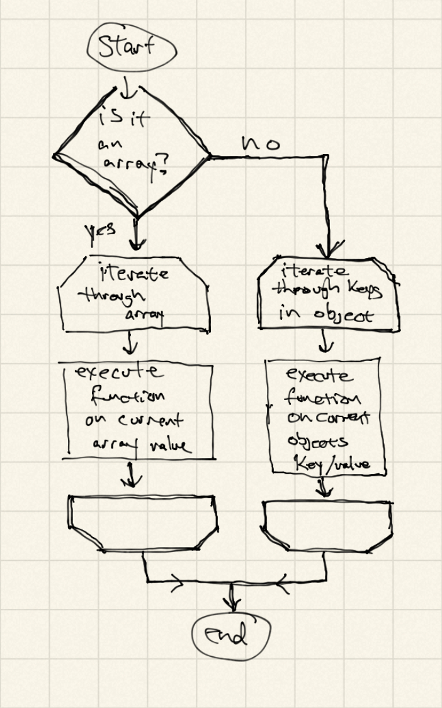

# a3-loscore
My first repository on GitHub

I will attempt to recreate a few underscore functions in an attempt to show how they work 'under the hood.'
This will be my practice as a beginner developer. First things first, I created a repository for this assignment.

1. _.each function
 
 
3. Completed the _.map function

4. Completed the _.reduce function

5. Completed the _.first function

6. Completed the _.initial function

7. Completed the _.last function

8. Completed the _.find function

9. Completed the _.filter function

10. Completed the _.reject function

11. Completed the _.every function

12. Completed the _.where function

13. Completed the _.findWhere function

14. Completed the _.some function

15. Completed the _.contains function

16. Completed the _.invoke function

17. Completed the _.max function
