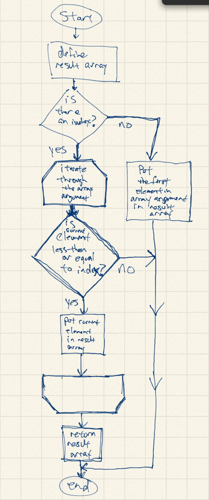

# a3-loscore
My first repository on GitHub

I will attempt to recreate a few underscore functions
in an attempt to show how they work 'under the hood.'
This will be my practice as a beginner developer. 

First off, I created a repository for this assignment.
And below are the functions with flow charts attached.

1. _.each function

 
2. _.map function

               
3. _.reduce function

4. _.first function

5. _.initial function

6. _.last function

7. Completed the _.find function

8. Completed the _.filter function

9. Completed the _.reject function

10. Completed the _.every function

11. Completed the _.where function

12. Completed the _.findWhere function

13. Completed the _.some function

14. Completed the _.contains function

15. Completed the _.invoke function

16. Completed the _.max function
